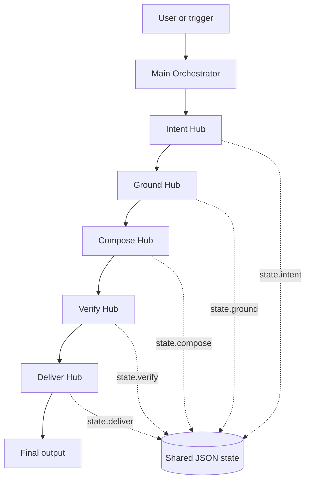
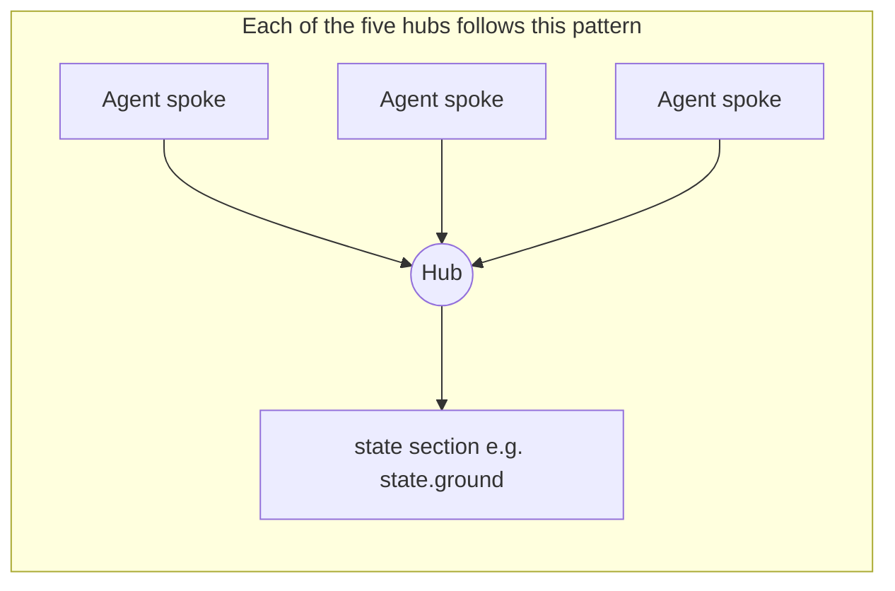

# HIVE Plugin for Claude Code

**Hub-based Intelligence & Verified Execution**

Repository: [github.com/Mart1M/hive-plugin](https://github.com/Mart1M/hive-plugin)

HIVE is an agentic architecture framework that structures AI systems around **specialized hubs**, a **central orchestrator**, a **shared state**, and a **verify-before-execute** philosophy.

---

## What is HIVE?

Most agentic systems are built as loose assemblages of prompts, tools, and workflows. This works for prototypes but quickly breaks down: logic is unstructured, responsibilities are unclear, generation drifts, decisions are hard to trace, and nothing is reusable.

**HIVE solves this architecturally.** The name expresses its core principle:

- **Hub-based** — the system is organized into specialized hubs
- **Intelligence** — each hub contains specialized agents that contribute to resolution
- **Verified** — no important output should be treated as reliable without a validation step
- **Execution** — the system produces an actionable result, not just a textual analysis

HIVE is simultaneously:
- an **architecture framework**
- an **orchestration method**
- a **convention for structuring agentic systems**
- a **layer interpretable by Claude Code**

### Hub-and-spoke

At **global** level, the **Main Orchestrator** drives the pipeline: it decides when each hub runs and updates the shared state. At **local** level, inside each hub, **agents** act as spokes that feed the hub, which writes **one** section of that state.

**Global view — from Main Orchestrator to hubs**



The orchestrator stays **thin**: it owns sequencing and transitions, not hub-internal reasoning.

**Inside one hub — agents as spokes**



Agents do not hand off arbitrarily to each other: they contribute **through** the hub, which merges their outputs and writes **only** to its slice of the shared state.

### Claude Code as an interpretable layer

In Claude Code, HIVE is not required to be a separate runtime. The plugin supplies **`CLAUDE.md`** and slash commands so the model reads and executes the **markdown and JSON** under `.hive/` (`hive.config.json`, `state.schema.json`, orchestrator and hub definitions, skills registry, rules). The canonical source for rollout order and governance checks is the implementation checklist in **`hive_system_documentation.md` (section 17)**.

---

## Architecture Overview

See the **Global view** diagram in [Hub-and-spoke](#hub-and-spoke): **Main Orchestrator →** Intent → Ground → Compose → Verify → Deliver, each hub reading/writing its part of the shared state.

The canonical flow is: **Intent → Ground → Compose → Verify → Deliver**

All hubs share a **structured JSON state** — the common memory of the system.

---

## The Five Hubs

### Intent Hub
Transforms a raw request into a structured intention. Answers: what is the real goal, what is the scope, what are the constraints, what are success criteria?

### Ground Hub
Brings all necessary knowledge into the system before composition. Limits hallucination risk by connecting the system to the project's reality — components, patterns, tokens, rules, documentation, examples.

### Compose Hub
Builds a structured solution from the intent and grounding. Produces blueprints, UI structures, action plans, component trees.

### Verify Hub
Validates the composed solution before delivery. Checks compliance with rules, accessibility, technical feasibility, and consistency. Produces a `valid / warnings / issues / fixes` report.

### Deliver Hub
Transforms the validated solution into an actionable artifact: code, JSON blueprint, markdown documentation, dev ticket, configuration file.

---

## Plugin Commands

After installation as a **Claude Code plugin**, commands are **namespaced** with the plugin id `hive` (see [Discover plugins](https://code.claude.com/docs/en/discover-plugins)).

| Namespaced (Claude Code) | Description |
|---|---|
| `/hive:hive-init` | Scaffold the full `.hive/` directory structure in your repo |
| `/hive:hive-run` | Run the full HIVE pipeline (orchestrator) on a task |
| `/hive:hive-intent` | Run the Intent Hub in isolation |
| `/hive:hive-ground` | Run the Ground Hub in isolation |
| `/hive:hive-compose` | Run the Compose Hub in isolation |
| `/hive:hive-verify` | Run the Verify Hub in isolation |
| `/hive:hive-deliver` | Run the Deliver Hub in isolation |
| `/hive:hive-status` | Display the current HIVE state for the active session |

Some environments (e.g. Cursor) may expose the same prompts as `/hive-init`, `/hive-run`, etc. without the `hive:` prefix.

---

## Getting Started

### 1. Install the plugin (private marketplace — not the Anthropic store)

This repo is a **marketplace repo**: the catalog is [`.claude-plugin/marketplace.json`](.claude-plugin/marketplace.json) at the root; the installable plugin lives in [`plugins/hive/`](plugins/hive/) (Claude Code rejects `source: "."` — the path must be a real subfolder like `./plugins/hive`). Marketplace id: **`hive-framework`**. Plugin id: **`hive`**.

**From a local clone** (adjust the path):

```text
/plugin marketplace add /Users/you/Development/hive-plugin
/plugin install hive@hive-framework
/reload-plugins
```

**From GitHub** (public repo):

```text
/plugin marketplace add Mart1M/hive-plugin
/plugin install hive@hive-framework
/reload-plugins
```

Equivalent HTTPS URL if needed: `https://github.com/Mart1M/hive-plugin`.

Use **`/plugin`** → Discover / Marketplaces to pick **user**, **project**, or **local** [install scope](https://code.claude.com/docs/en/discover-plugins#install-plugins) as needed. To refresh the catalog after a git pull: `/plugin marketplace update hive-framework`.

If you already added this repo **before** the `plugins/hive` layout, remove that marketplace entry, then add again (cached copy may still have invalid `source`):

```text
/plugin marketplace list
/plugin marketplace remove hive-framework
/plugin marketplace add Mart1M/hive-plugin
```

If your CLI shows a different marketplace id, use the name from **`list`** in `remove`.

**Dry-run without marketplace:** `claude --plugin-dir /path/to/hive-plugin/plugins/hive` (see [Create plugins](https://code.claude.com/docs/en/plugins)).

**Claude Code** reads the manifest at [`plugins/hive/.claude-plugin/plugin.json`](plugins/hive/.claude-plugin/plugin.json). [`plugins/hive/settings.json`](plugins/hive/settings.json) is mainly for editors; keep [`plugins/hive/CLAUDE.md`](plugins/hive/CLAUDE.md) for HIVE rules — add it to your project’s rules or open it from the installed plugin copy if needed.

### 2. Scaffold HIVE in your project

In Claude Code, navigate to your project root and run (namespaced form):

```
/hive:hive-init
```

This creates the full `.hive/` directory structure with placeholder files for every hub, agent, skill, and rule.

### 3. Configure your use case

Edit `.hive/hive.config.json` to define:
- your domain (design-system, product-spec, coaching, etc.)
- your truth sources
- your expected output formats
- your governance constraints

### 4. Run HIVE

For a full pipeline execution:
```
/hive:hive-run Create a checkout page with cart summary and payment form
```

For individual hubs (useful for debugging or incremental work):
```
/hive:hive-intent Understand what the user needs for the checkout page
/hive:hive-ground Gather all DS components and patterns relevant to checkout
/hive:hive-compose Build the checkout page blueprint
/hive:hive-verify Validate the blueprint against DS rules and accessibility
/hive:hive-deliver Generate code scaffold and markdown spec
```

---

## Shared State Structure

All hubs read from and write to a shared JSON state. Each hub writes only to its own section:

```json
{
  "request": {
    "id": "",
    "source": "",
    "raw_input": ""
  },
  "intent": {},
  "ground": {},
  "compose": {},
  "verify": {},
  "deliver": {},
  "meta": {
    "version": "1.0.0",
    "status": "initialized"
  }
}
```

---

## HIVE Founding Principles

1. **Separation of responsibilities** — each part of the system has a clear role
2. **Explicit orchestration** — a central entity manages step order and state transitions
3. **Structured shared state** — agents collaborate via a common structure, not implicit text flow
4. **Systematic verification** — composition outputs must be validated before delivery
5. **Domain extensibility** — HIVE applies to design systems, UI generation, coaching, tech docs, and more

---

## Anti-Patterns to Avoid

- **Monolithic agent** — one agent that understands, grounds, composes, validates, and delivers everything
- **Implicit state** — relying on conversational context or text flow instead of structured state
- **Over-broad skills** — a skill that can "do anything" without guardrails
- **Missing verification** — composing then delivering directly with no validation step
- **Blurry hub boundaries** — hubs whose responsibilities strongly overlap

---

## HIVE in Your Project

HIVE is designed to be a **readable, interpretable structure** — not a black-box runtime. Every file in `.hive/` is a markdown or JSON document that Claude can read, follow, and act upon. You customize the agents, skills, and rules to match your project's reality.
